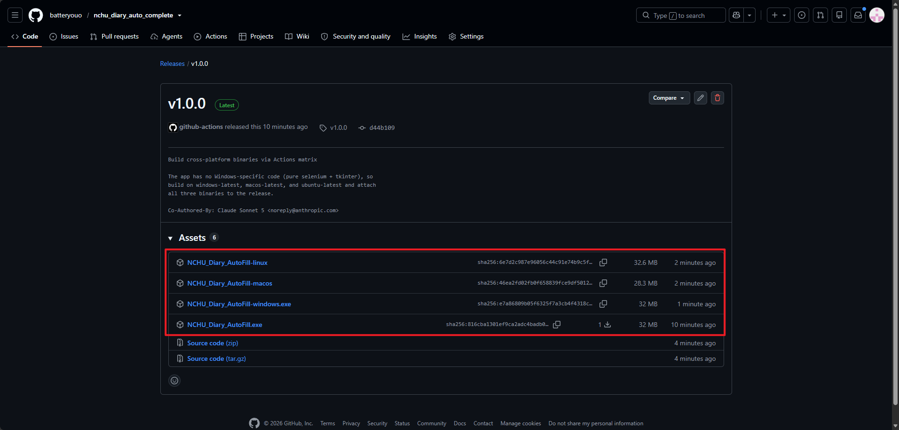
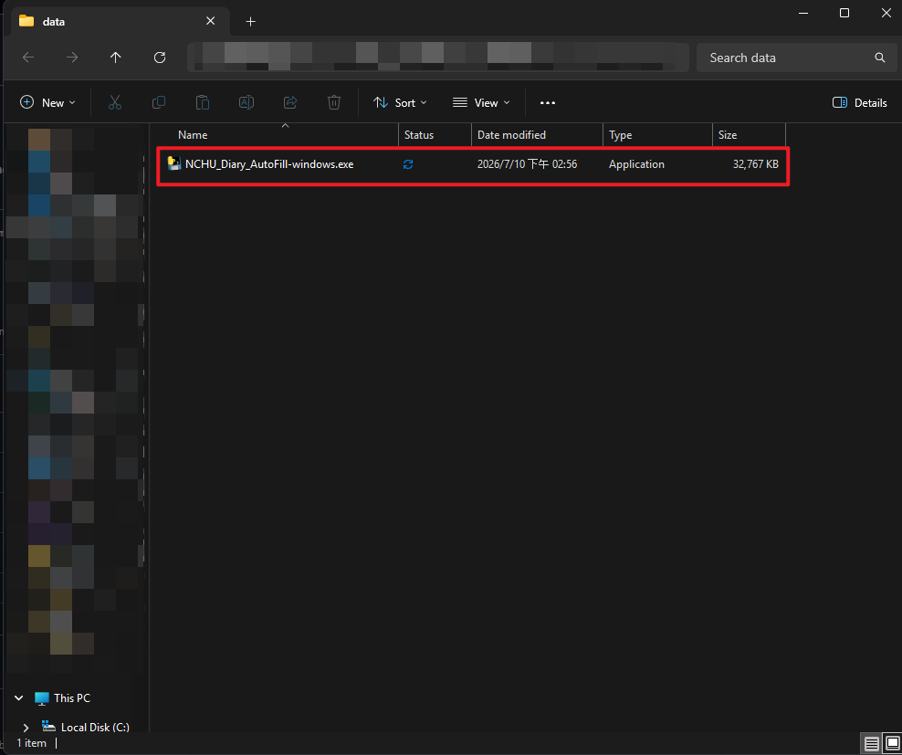
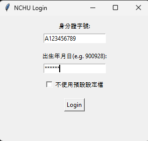
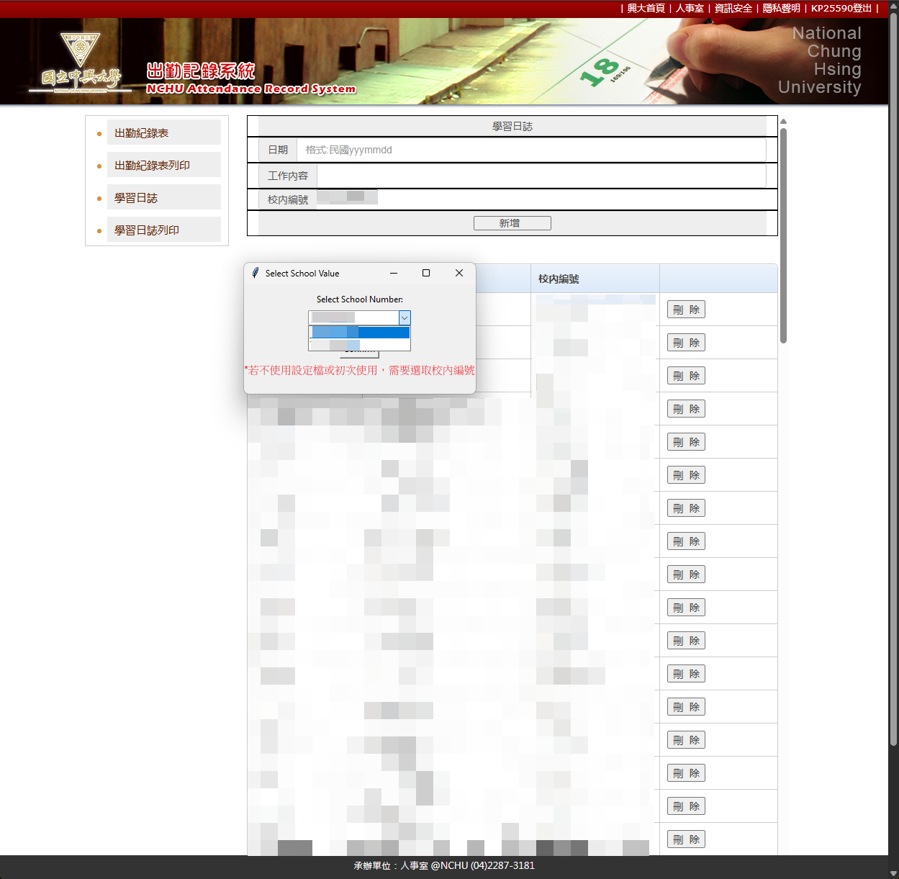
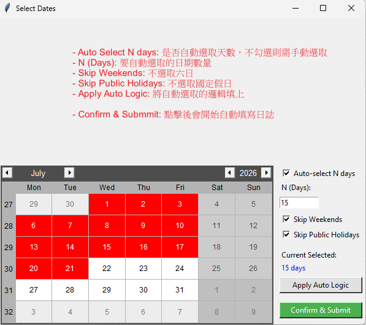

# NCHU Learning Log Automator

這是一個專為中興大學學生設計的自動化工具，用於快速填寫學習日誌並產出報表。

---

### 核心功能
- 圖形化登入介面：提供 GUI 輸入學號與密碼，並支援記住資訊。

- 智慧日期選取：
  - 多選日曆：可自由點選本月要填寫的日期。
  - 自動選取 N 天：預設自動選取 15 天，省去逐一核對的時間。
  - 過濾機制：自動跳過週末（可選）以及網頁上已經存在紀錄的日期。

- 自動化填寫：自動登入、切換框架 (Frame)、選取計畫單位並填入工作內容。

- 報表自動產出：填寫完成後自動跳轉至列印頁面，並根據「自定義月份」或「當前日期」自動設定報表區間。

- 多瀏覽器支援：系統會依序嘗試啟動 Edge、Chrome 或 Firefox。

---

### 快速開始（一般使用者，不需要裝 Python）

1. 到 [Releases](https://github.com/batteryouo/nchu_diary_auto_complete/releases/latest) 頁面，依你的作業系統下載對應檔案（Windows 選 `-windows.exe`，macOS 選 `-macos`，Linux 選 `-linux`）。

   

2. 放到你想要的資料夾，雙擊執行（`config.json` 會自動產生在同一個資料夾）。

   

3. 如果 Windows Defender 或防毒軟體跳出警告（PyInstaller 打包的執行檔沒有簽章，常被誤判），選擇「仍要執行」。
4. 依照下方「使用說明」完成登入與日期選取即可。

---

### 檔案結構

- main.py: 程式進入點，負責整體的執行流程邏輯。

- user_ui.py: 包含所有的 GUI 視窗類別（登入、校號選擇、日期多選）。

- utils.py: 存放瀏覽器驅動設定、日期轉換（民國年/西元年）及網頁元素爬取等工具函式。

- config.json: 儲存使用者設定、學號與計畫編號（自動生成）。

### 使用環境

- Python 3.x
- 必要套件：
```
pip install selenium webdriver-manager tkcalendar holidays
```

---

### 打包成 exe

#### 方法一：GitHub Actions 自動建置（推薦，不需要在本機安裝 Python/uv）

專案已設定 `.github/workflows/build.yml`：

- 推上 `v*` 開頭的 tag（例如 `git tag v1.0.0 && git push origin v1.0.0`）：GitHub 會分別在 Windows、macOS、Linux 三個平台上自動建置，並把 `NCHU_Diary_AutoFill-windows.exe`、`NCHU_Diary_AutoFill-macos`、`NCHU_Diary_AutoFill-linux` 都附加到對應的 Release，直接到 Releases 頁面依平台下載即可。
- 也可以到 GitHub 專案的 Actions 頁籤，手動觸發 `Build exe` workflow（workflow_dispatch），完成後在該次執行的 Artifacts 下載對應平台的執行檔，不會建立 Release。

整個下載依賴、打包的過程都在 GitHub 的雲端機器上執行，本機不需要裝 Python 或 uv。

#### 方法二：本機手動打包（開發者，需要先裝 [uv](https://docs.astral.sh/uv/)）

```
uv sync
uv run pyinstaller NCHU_Diary_AutoFill.spec
```

打包完成後，執行檔會在 `dist/NCHU_Diary_AutoFill.exe`，可直接分享給其他使用者雙擊執行。

---

### 使用說明

1. **登入**：輸入身分證字號與出生年月日（格式如 900928）。第一次使用、或想換一個計畫單位時，勾選「不使用預設設定檔」。

   

2. **選擇計畫單位**（僅在有多個可選、且未使用設定檔時出現）：從下拉選單選你的校內編號。

   

3. **選擇要填寫的日期**：畫面上的說明文字已經對應每個按鈕的功能，預設會自動勾選本月 15 天（跳過六日與國定假日），也可以直接在日曆上手動點選增減，設定好後按 **Confirm & Submit**。

   

4. 程式會自動開啟瀏覽器並依序填入所選日期，完成後跳轉到列印報表頁面並暫停，確認資料無誤後手動關閉瀏覽器，程式才會結束。